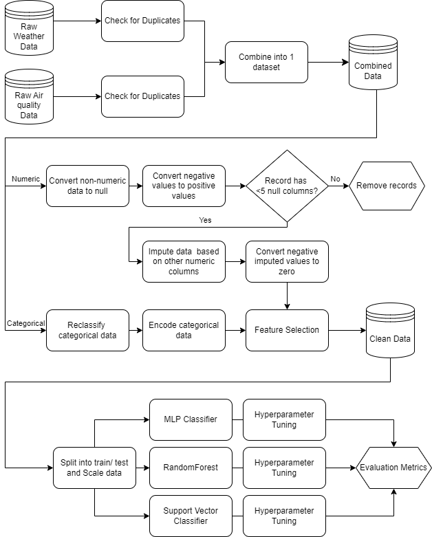

# README

## **a. Full name and email address.**

Full name: Ray Tng Rui Kiat\
Email address: rayof21hopes@yahoo.com.sg

## **b. Overview of the submitted folder and the folder structure.**

```
├── src
│   └── main.py
│   └── settings.py
│   └── preprocessing.py
│   └── models.py
├── data
│   └── air_quality.db
│   └── weather.db
├── README.md
├── eda.ipynb
├── requirements.txt
└── run.sh
```

## **c. Instructions for executing the pipeline and modifying any parameters.**

1. From the base folder, run `py -m pip install -r requirements.txt`. This should install all required dependencies.
2. Run `./run.sh`. If there is an error, please try executing `chmod u+x run.sh`

When the pipeline is executed, 3 models from `scikit-learn` are used:

1. `MLPClassifier`
2. `RandomForestClassifer`
3. `SVC`

They are optimized with their respective parameter spaces via `RandomizedSearchCV`

To test other models from `scikit-learn` or change the parameter spaces:

1. Go to `src/models.py` and import the relevant model from `scikit-learn`
2. Go to the function `define_models` and add your model or amend the parameter spaces respectively

## d. Description of logical steps/flow of the pipeline.



### 1. Preprocessing and Feature Engineering

#### Merge datasets

1. Raw Weather and Air Quality data are loaded from the databases
2. Duplicates are removed using the `data_ref` and `date`features
3. Both datasets are merged using the `date` feature

#### Clean Numeric data

1. Converted non-numeric values like '-' and '--' into nulls
2. Converted negative values into positive values using `abs`
3. Removed records with null values in >=5 features since they are insignificant (<5%)
4. Imputed null values using `sklearn`'s `IterativeImputer`

#### Clean Categorical data

1. Relabeled values with the same meaning but labelled inconsistently e.g. "High", "H" and "HIGH"
2. Used ordinal encoding for ordered categorical values like _Dew Point Category_ and _Daily Solar Panel Efficiency_
3. Used directional encoding for nominal categorical values like _Wind Direction_

#### Feature Selection

1. Took the averages of PM25 and PSI values since we do not have the location data of the solar panels
2. Removed the features with data on rainfall measurements and cloud cover
3. Converted date into day of the year to include effects of seasonality

### 2. Modelling

1. Cleaned data is scaled using `StandardScaler()` and passed into the 3 models `MLPClassifier`, `RandomForestClassifier` and `SVC` through the `RandomizedSearchCV` hyperparameter tuning cross validation function.
2. Metric scores like accuracy, f1_score (both overall and class-specific) and a custom weighted cost score are obtained.

## e. Overview of key findings from the EDA

| Key Finding                                                                                                                                                            | Action                                                                          |
| ---------------------------------------------------------------------------------------------------------------------------------------------------------------------- | ------------------------------------------------------------------------------- |
| There are 320 and 678 duplicate records in the weather and air quality datasets respecitvely                                                                           | Remove the duplicates using the data_ref and date features                      |
| Some features were not of the appropriate data type                                                                                                                    | Change the datatypes appropriately                                              |
| There are negative values in the _Max Wind Speed_ and _Wet Bulb Temperature_ features with ranges of the absolute values consistent with that of other positive values | Change them to positive by taking the absolute value                            |
| There are missing values in some numerical features coded as '-' or '--'                                                                                               | Change them to nulls                                                            |
| There are 1990/2342 records with at least 1 feature with a null value                                                                                                  | Unable to just remove them                                                      |
| There are 62 records with null values in >= 5 features                                                                                                                 | Remove these records                                                            |
| There are 1928 records with null values in <=4 features                                                                                                                | Impute these values based on the other numerical features                       |
| Some imputed values were impossible (e.g. negative rainfall values)                                                                                                    | Adjust imputed values accordingly                                               |
| _Dew Point Category_ and _Wind Direction_ had labels with the same meaning but different representations (e.g. 'High', 'H', 'HIGH')                                    | Relabelled them to be consistent                                                |
| _Dew Point Category_ and _Daily Solar Panel Efficiency_ were ordered categories                                                                                        | Used ordinal encoding                                                           |
| _Wind Direction_ can be converted into numerical data                                                                                                                  | Converted direction into angles in radians                                      |
| Data spans from 2014 to 2022 (multi-year)                                                                                                                              | Convert date into day of the year to capture seasonal variations                |
| There is a high correlation between the various PM25 and PSI values                                                                                                    | Aggregate them by finding the average value                                     |
| There is a high correlation/ inverse correlation between Daily Solar Panel Efficiency, Cloud cover, sunshine duration with the various rainfall measurements           | Drop the rainfall measurement features and cloud cover feature from the dataset |

## f. Describe how the features in the dataset are processed (summarised in a table).

| Feature                                                                                                          | Processing Steps                                              |
| ---------------------------------------------------------------------------------------------------------------- | ------------------------------------------------------------- |
| data_ref                                                                                                         | Removed                                                       |
| date                                                                                                             | Converted to day of the year                                  |
| Daily Rainfall Total (mm)                                                                                        | Removed                                                       |
| Highest 30 Min Rainfall (mm)                                                                                     | Removed                                                       |
| Highest 60 Min Rainfall (mm)                                                                                     | Removed                                                       |
| Highest 120 Min Rainfall (mm)                                                                                    | Removed                                                       |
| Min Temperature (deg C)                                                                                          | Missing values imputed                                        |
| Maximum Temperature (deg C)                                                                                      | Missing values imputed                                        |
| Min Wind Speed (km/h)                                                                                            | Missing values imputed                                        |
| Max Wind Speed (km/h)                                                                                            | Negative values converted to positive, Missing values imputed |
| Sunshine Duration (hrs)                                                                                          | Missing values imputed                                        |
| Cloud Cover (%)                                                                                                  | Removed                                                       |
| Wet Bulb Temperature (deg F)                                                                                     | Negative values converted to positive                         |
| Relative Humidity (%)                                                                                            | None                                                          |
| Air Pressure (hPa)                                                                                               | None                                                          |
| Dew Point Category                                                                                               | Relabelled, Ordinal encoding                                  |
| Wind Direction                                                                                                   | Relabelled, Directional encoding                              |
| Daily Solar Panel Efficiency                                                                                     | Ordinal encoding                                              |
| pm25_north, pm25_south, pm25_east, pm25_west,pm25_central, psi_north, psi_south, psi_east, psi_west, psi_central | Missing values imputed, Aggregated into an average            |

## g. Explanation of your choice of models for each machine learning task.

The machine learning task was to develop models to predict the solar panel efficiency as **Low**, **Medium** or **High** based on weather and air quality data.\
The significance of the task was for the company to:

1. Schedule maintenance/ cleaning/ repairs during **Low** efficiency days to minimise downtime
2. Increase battery capacity during **High** efficiency days for storage of excess power generated ensuring a steady supply

My takeaway is that this task is a classification task and interpretability of the model is not crucial.

**Models**:

1. Neural Net Classifier (MLP Classifier)

- Multi-layer Perceptron Classifiers (MLP Classifiers) are able to capture any complex, non-linear relationships between weather features like temperature, humidity, sunshine duration, accounting for interactions between these features.
- The dataset is mostly numerical data which MLP Classifiers handle well.

2. RandomForest

- Able to handle both numerical and categorical data well
- Robust to over-fitting
- Effective in capturing non-linear relationships between features

3. Support Vector Classifier (SVC)

- Effective in capturing non-linear relationships between features
- Robust to over-fitting
- Dataset is considered small-medium size with 2000 records, hence SVC is still computationally efficient (will not be for larger datasets)

## h. Evaluation of the models developed. Any metrics used in the evaluation should also be explained.

**Rationale for metrics**

1. Accuracy

- [Proportion of correct predictions among total number of cases] = (True Positives + True Negatives) / Total Instances
- It is used as a straightforward measure for correct predictions. But it does not give any insights into how the model performs for each class, especially in our imbalanced dataset where on most days, the _Daily Solar Panel Efficiency_ is **Medium**.

2. F1 score

- [Harmonic mean of precision and recall, giving equal weight to both metrics]= 2 x (precision x recall) / (precision + recall)
- It balances precision and recall, making it suitable for imbalanced datasets. It considers both false positives and negatives. However, it does not take into account the varying costs associated with the different types of misclassification. For example, classifying a **Low** as a **Medium** is given the same weight as classifying a **Low** as a **High**.
- I chose the _macro_ average as it gives equal weight to all classes regardless of their size. In the dataset, **Low** and **High** are under-represented compared to **Medium**. In this task, it seems more important to correctly classify the _Daily Solar Panel Efficiency_ as **Low** or **High**. Hence by giving equal weight to all classes, I am reducing the weight of **Medium** and increasing the weight of **Low** and **High**.

3. Class specific metrics

- To identify individual class specific Accuracy and F1 scores so as to have an idea of whether there is an imbalance in the performance of the models.

4. Weighted Cost

- Without the costs associated with false negatives and false positives, I have come up with some arbitrary costs for misclassification.

<ins>Misclassification cost table</ins>
| | Predicted High | Predicted Medium | Predicted Low |
| ------------- | -------------- | ---------------- | ------------- |
| Actual High | 0 | 2 | 4 |
| Actual Medium | 1 | 0 | 2 |
| Actual Low | 3 | 1 | 0 |

- The idea behind the costs projected are as follows:
  1. Greater cost to incorrect predictions of actual **High** compared to actual **Low** Solar Panel Effiency.
     a. I.e. worse to miss out on storing energy than miss out on maintenance days
  2. Lower cost to incorrectly predicting **Medium** Solar Panel Efficiency compared to the extremes (**Low** or **High**).
- When we have the actual costs for various misclassifications, the cost_matrix can be updated accordingly

**Evaluation of models**

**Metrics:**\
<ins>Overall results</ins>
| |Overall Accuracy |Overall F1 Score |Weighted Cost|
|---|---|---|---|
|**RandomForestClassifier** | 82.16% | 0.78 | 242|
|**Neural Net Classifier** | 79.82% | 0.76 | 269|
|**SVC** | 78.07% | 0.73 | 288|

<ins>Class specific results</ins>
| |DSPE_HIGH Accuracy |DSPE_HIGH F1 |DSPE_MEDIUM Accuracy |DSPE_MEDIUM F1 | DSPE_LOW Accuracy |DSPE_LOW F1|
|---|---|---|---|---|---|---|
|**RandomForestClassifier** | 0.89 | 0.70 | 0.85 | 0.88 | 0.90 | 0.77|
|**Neural Net Classifier** | 0.85 | 0.61 | 0.83 | 0.86 | 0.91 | 0.80|
|**SVC** | 0.83 | 0.54 | 0.81 | 0.85 | 0.92 | 0.80|

1. From the overall scores, all 3 models performed generally well, with overall accuracy and F1 scores nearing the 0.8 mark.
2. However, when we dive into the class specific results, it seems that the models are performing well due to better predictions for **Medium** _Daily Solar Panel Efficiency_ rather than those of the extremes. This can be seen from the disparity between accuracy and F1 scores of the **High** and **Low** classes as well as the similar accuracy and F1 scores of the **Medium** class. This might not be ideal, some domain knowledge would be required here to determine which incorrect predictions should be assigned a higher cost.
3. RandomForest seems to give the best result, followed by Neural Net Classifier and then SVC based on the proposed weighted cost score, overall F1 score and the overall Accuracy score. This seems to stem from a higher F1 score for correctly predicting a **High** _Daily Solar Panel Efficiency_. Even though RandomForest fares marginally worse on predicting a **Low** _Daily Solar Panel Efficiency_, it still attained the best overall metrics.

## i. Other considerations for deploying the models developed.

I used `RandomizedSearchCV` for hypertuning of parameters. The alternative was to use `GridSearchCV`. However, as I do not have a good understand of the hyperparameter ranges, I went with the randomized version instead. Parameter spaces were defined based on references online. For example, in the randomforest model,max_features to consider when looking for the best split was suggested as sqrt(number of features). In this task, my final number of features was 14. Since sqrt(14) = 3.7, I chose 3-7 as the parameter space.
